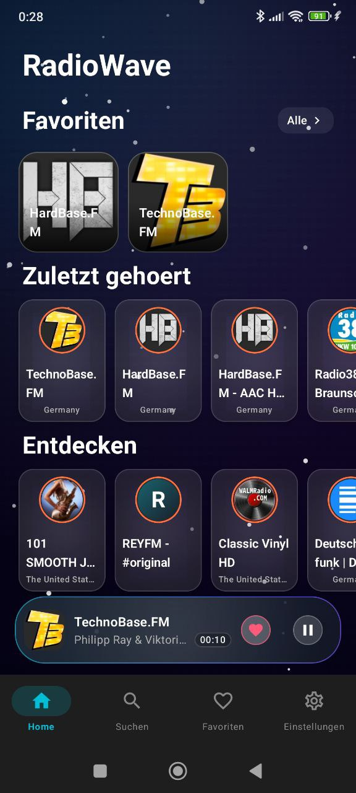
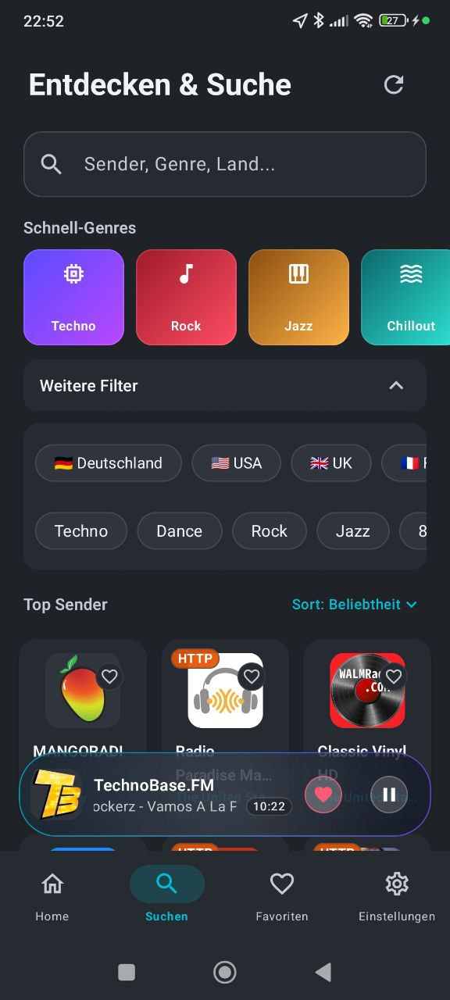
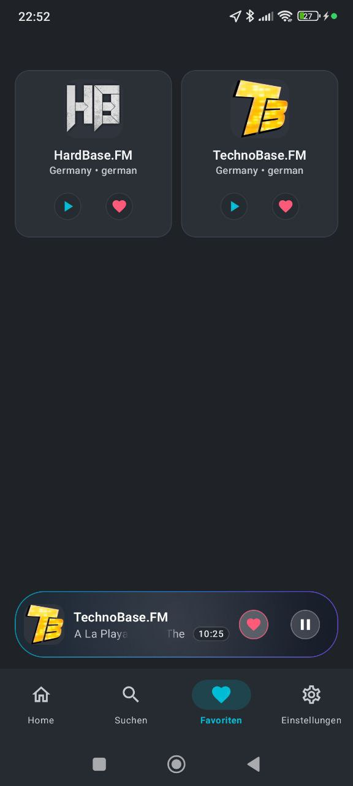
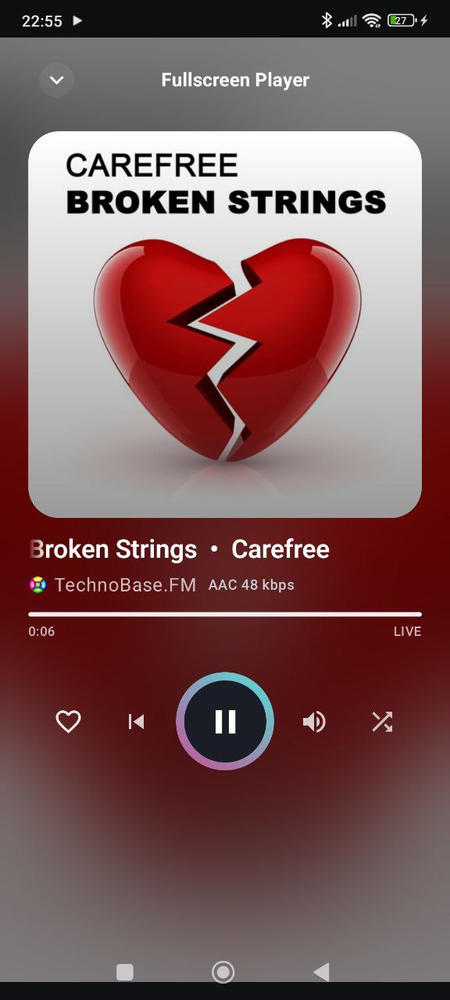
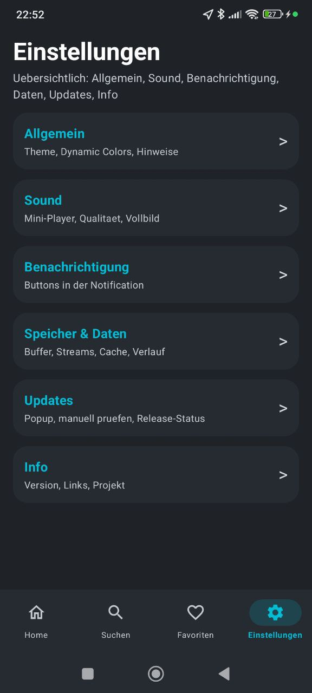
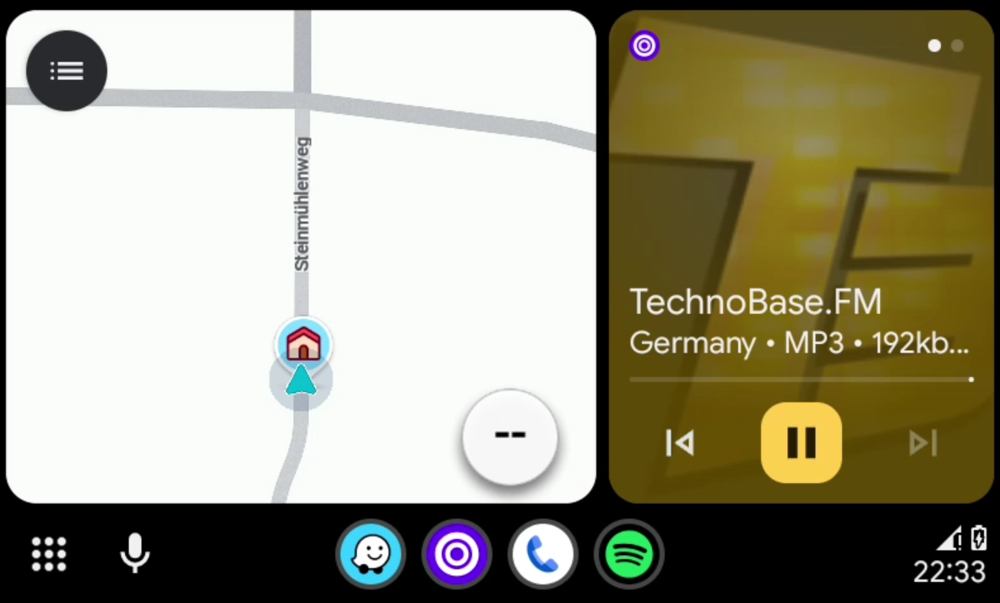
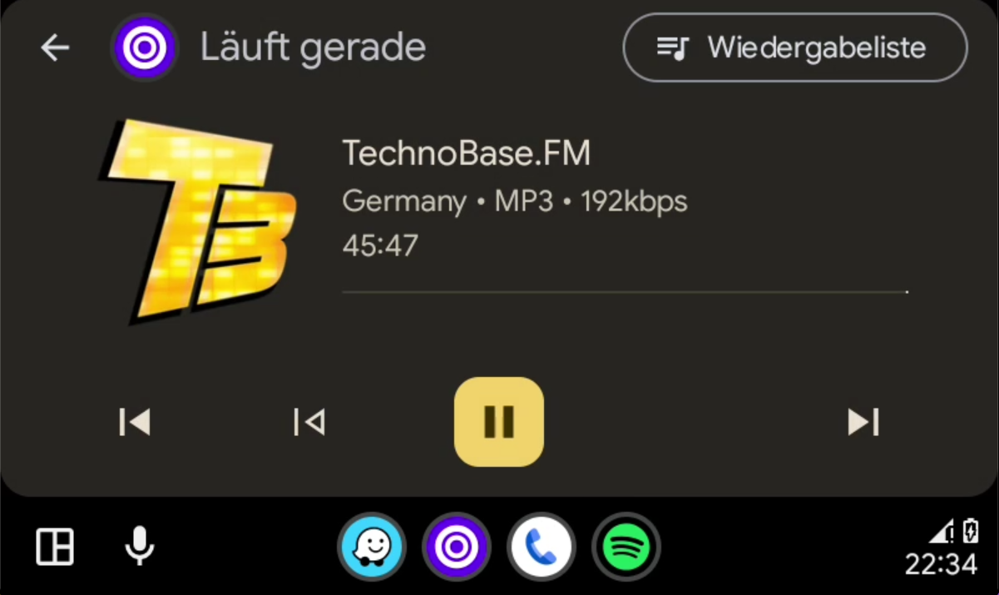
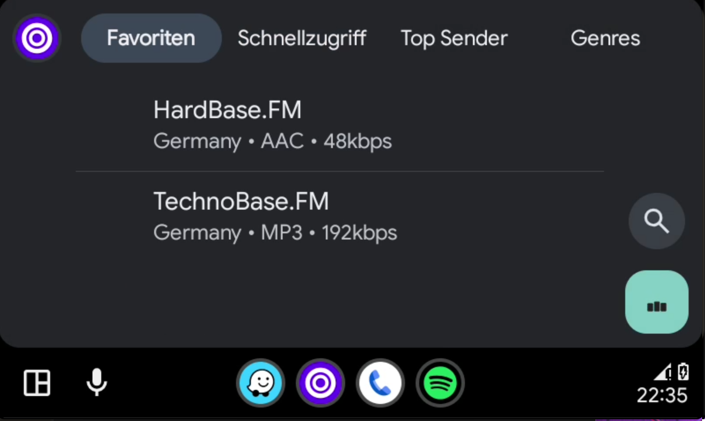
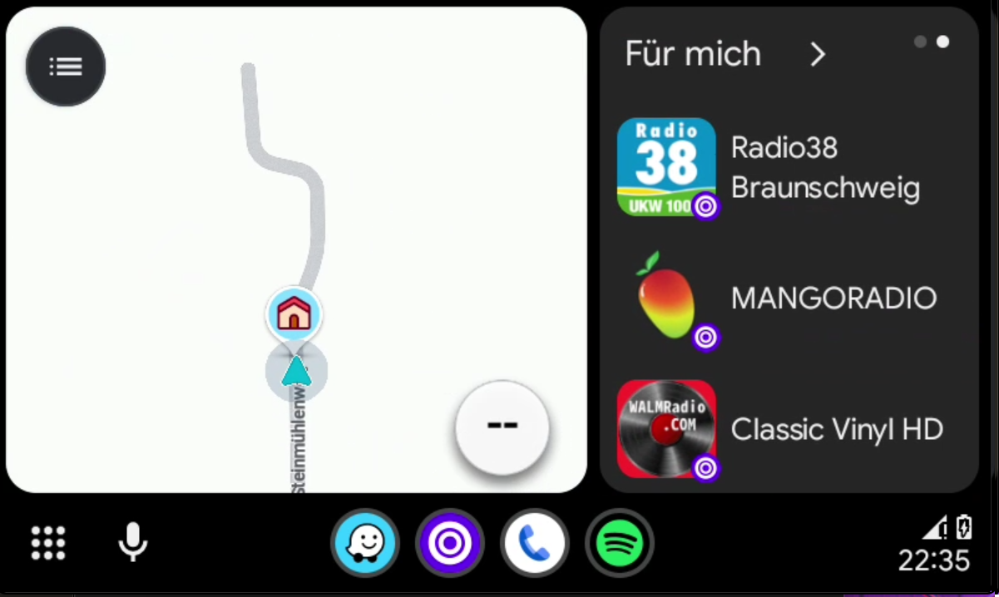

# RadioWave

[Deutsch](README.de.md) | [English](README.md)

<div align="center">

  <a href="https://github.com/darksoon/RadioWave/actions/workflows/pr-ci.yml">
    
  </a>
  <a href="https://github.com/darksoon/RadioWave/releases/latest">
    
  </a>
  
  
  <a href="./LICENSE.txt">
    
  </a>
  <a href="https://ko-fi.com/darksoon">
    
  </a>

  <h3>Die moderne, werbefreie Internet-Radio-App fuer Android.</h3>
  <p>Schnell | Privacy-first | Kein Tracking | 45.000+ Sender</p>
  <p>Projekt-Website: <a href="https://radiowave.sven-neurath.de">radiowave.sven-neurath.de</a></p>
</div>

---

## Roadmap

Die oeffentliche Roadmap liegt in [ROADMAP.de.md](./ROADMAP.de.md).

- Fokus: Stabilitaet und Nutzerwert
- Wird laufend mit Releases und Polishing aktualisiert
- Feedback gerne ueber GitHub Issues

## Verfuegbarkeit

- Website: https://radiowave.sven-neurath.de
- Google Play: https://play.google.com/store/apps/details?id=de.darksoon.radiowave
- GitHub Releases: https://github.com/darksoon/RadioWave/releases/latest
- Android-Paketname / `applicationId`: `de.darksoon.radiowave`

## Highlights

- Kein Account noetig, alles bleibt lokal auf dem Geraet
- Komplett werbefrei, keine Analytics, kein Verhaltenstracking
- 45.000+ Sender ueber Radio Browser
- Album-Cover ueber die iTunes Search API
- Launcher Quick Actions fuer `Suche`, `Favoriten`, `Player` und `Settings`
- Android Auto mit Favoriten, Quick Access, Suche und Vor/Zurueck im Car-Player
- Chromecast / Google Cast mit direkter Geräteauswahl aus dem Player
- Sleep Timer und direkte Teilen-Aktion im Fullscreen-Player
- Lokaler Crash-Report mit Export/Share und vorbereiteter GitHub-Issue-Erstellung

## Screenshots

| Home | Suche |
|---|---|
|  |  |

| Favoriten | Fullscreen Player | Einstellungen |
|---|---|---|
|  |  |  |

| Android Auto 1 | Android Auto 2 |
|---|---|
|  |  |

| Android Auto 3 | Android Auto 4 |
|---|---|
|  |  |

## Tech Stack

- Kotlin 2.1.0
- Jetpack Compose + Material 3
- Clean Architecture + MVVM
- Hilt
- Media3 / ExoPlayer
- Room
- Retrofit + Kotlinx Serialization

## Quick Start

```bash
git clone https://github.com/darksoon/RadioWave.git
cd RadioWave
chmod +x gradlew
./gradlew :build-logic:build
./gradlew assembleDebug
```

## Lokale Builds

```bash
# Voller Build
./gradlew build

# Lint + Tests
./gradlew lint
./gradlew test

# Debug APK installieren
./gradlew installDebug

# GitHub-Flavor-Debug-Build
./gradlew :app:assembleGithubDebug

# Play-Store-Debug-Build
./gradlew :app:assemblePlayDebug
```

### Restriktive Netzwerke / Proxy

Wenn Gradle-Downloads blockiert sind, nutze Mirror oder Proxy:

```properties
# ~/.gradle/gradle.properties
systemProp.http.proxyHost=<proxy-host>
systemProp.http.proxyPort=<proxy-port>
systemProp.https.proxyHost=<proxy-host>
systemProp.https.proxyPort=<proxy-port>
```

## Release Signing

Signierte Release-Builds laufen ueber GitHub Actions.

- Fuer GitHub / Direktdownload ist die signierte `github`-APK gedacht
- Fuer die Google-Play-Auslieferung ist das signierte `play`-App-Bundle (`.aab`) gedacht

Nur fuer lokale Experimente:

```bash
cp keystore.properties.example keystore.properties
# keystore.properties bearbeiten
```

## Installation

### Google Play

Installiere RadioWave ueber Google Play:

https://play.google.com/store/apps/details?id=de.darksoon.radiowave

### GitHub-APK

1. Oeffne die aktuelle Release-Seite:
   `https://github.com/darksoon/RadioWave/releases/latest`
2. Lade das aktuelle APK-Asset herunter.
3. Erlaube Installationen aus unbekannten Quellen, falls dein Geraet danach fragt.
4. Oeffne die APK und installiere sie.

## Player-Verbesserungen

- Kurze Netzwerkunterbrechungen werden deutlich robuster abgefangen
- Der Wiedergabe-Timer zeigt jetzt echte Hoerzeit und pausiert bei Buffering
- Im Fullscreen-Player gibt es jetzt Teilen und Sleep Timer
- Favoriten lassen sich im Favoriten-Screen einfacher umsortieren
- Aktive Chromecast-Sessions lassen sich direkt aus dem Fullscreen-Player starten, Senderwechsel werden an den TV uebergeben und Play/Pause in der App steuert das Cast-Ziel

## Android Auto

- Browse ist fuer In-Car-Nutzung optimiert: `Favoriten`, `Quick Access`, `Top Sender`, `Genres`
- Quick Access kombiniert Favoriten und Recents
- Suche fuehrt lokale und entfernte Treffer robuster zusammen
- Vor/Zurueck im Car-Player funktioniert als echte Sendernavigation

Siehe auch: [docs/ANDROID_AUTO_DEV_MODE.de.md](docs/ANDROID_AUTO_DEV_MODE.de.md)

## Chromecast / Google Cast

- Cast-Geraete koennen direkt aus dem Fullscreen-Player ausgewaehlt werden
- Beim Start einer Cast-Session wechselt der aktuelle Sender auf den TV und die parallele Handy-Wiedergabe wird gestoppt
- Senderwechsel waehrend des Castens aktualisieren den TV-Stream statt lokal einen zweiten Stream zu starten
- Play/Pause in der App steuert die aktive Cast-Session
- Der Player zeigt sichtbar an, wenn die Wiedergabe gerade auf dem TV laeuft
- Alexa / Echo ist **nicht** Teil dieser Cast-Integration und wuerde eine separate Amazon-spezifische Loesung brauchen

## GitHub Actions

### Manual Android Build

Unter `Actions -> Manual Android Build -> Run workflow`.

### PR CI

- Laeuft automatisch bei Pushes und Pull Requests auf `main`
- Kann auch manuell gestartet werden
- Nutzt Gradle Build Cache plus Configuration Cache
- Die Test-Task-Steuerung ist configuration-cache-sicher, damit CI bei Modulen ohne Unit-Tests nicht mehr kippt

### Release Build

- Signierte Releases entstehen ueber `Actions -> Release Build`
- Der Workflow:
  - aktualisiert `app.versionName` und `app.versionCode`
  - baut eine signierte Play-APK plus ein Play-Store-App-Bundle (`.aab`)
  - erstellt Tag und GitHub Release
  - haengt Release-Artefakte inklusive nativer Debug-Symbole fuer die Play Console an
- Die Workflows sind fuer die GitHub-Actions-Node-24-Umstellung vorbereitet (`actions/checkout@v5`)

## Datenschutz

- Keine Analytics
- Keine Werbung
- Keine versteckte Telemetrie
- Crash-Reports werden nur lokal gespeichert und nur aktiv vom Nutzer geteilt

## Lizenz

RadioWave steht unter der GNU General Public License v3.0 oder spaeter.
Siehe [LICENSE.txt](./LICENSE.txt).

Fuer Kotlin-Quelldateien wird `SPDX-License-Identifier: GPL-3.0-or-later` verwendet.

## Links

- Website: https://radiowave.sven-neurath.de
- Google Play: https://play.google.com/store/apps/details?id=de.darksoon.radiowave
- GitHub Releases: https://github.com/darksoon/RadioWave/releases/latest
- Ko-fi: https://ko-fi.com/darksoon

## Credits

- Senderdaten: [Radio Browser API](https://www.radio-browser.info/)
- Album-Cover: [iTunes Search API](https://developer.apple.com/library/archive/documentation/AudioVideo/Conceptual/iTuneSearchAPI/)
- Icons: Material Design Icons
