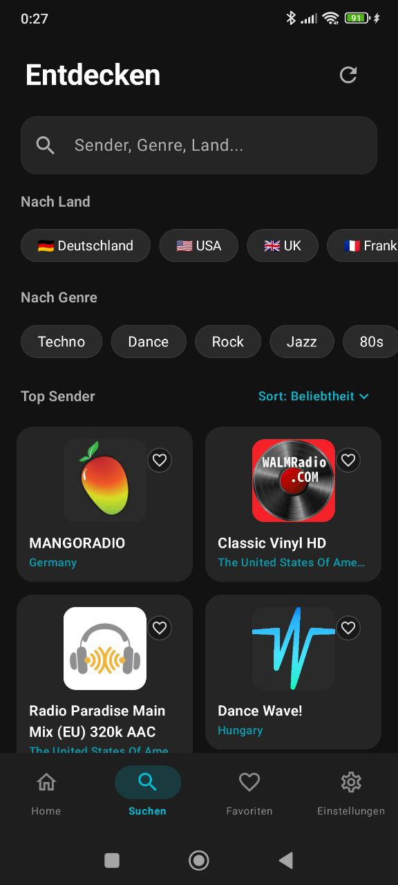
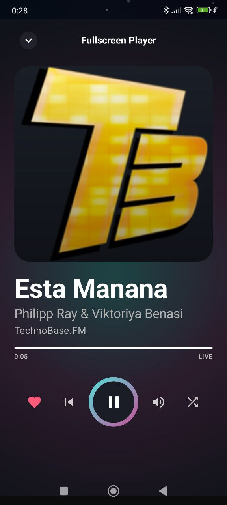

# RadioWave

<div align="center">
  <a href="https://github.com/darksoon/RadioWave/actions/workflows/pr-ci.yml">
    
  </a>
  <a href="https://github.com/darksoon/RadioWave/actions/workflows/manual-build.yml">
    
  </a>
  
  <a href="./LICENSE.txt">
    
  </a>
  <a href="https://buymeacoffee.com/darksoon">
    
  </a>

  <h3>Die moderne, werbefreie Internet-Radio-App für Android.</h3>
  <p>⚡ Schnell · 🔒 Privacy-first · 🚫 Kein Tracking · 🎧 45.000+ Sender</p>
  <p>🌐 Entwickler-Website: <a href="https://sven-neurath.de">sven-neurath.de</a></p>
</div>

---

## 🗺️ Roadmap

Die öffentliche Roadmap findest du hier: **[ROADMAP.md](./ROADMAP.md)**

- Fokus: Stabilität + Nutzerwert
- Stand wird laufend mit Releases/Hotfixes aktualisiert
- Vorschläge/Feedback gerne über Issues

## ✨ Highlights

- **Kein Account nötig** – alles lokal auf dem Gerät
- **Komplett werbefrei** – kein Tracking, keine Analytics
- **45.000+ Sender** über Radio Browser
- **Album-Cover** – automatisch von iTunes API (basiert auf Song-Metadaten)
- **Android Auto** Support
- **Chromecast** Support
- **Material You** UI mit modernem Dark Look

## 📸 Screenshots

| Home | Entdecken |
|---|---|
|  |  |

| Favoriten | Fullscreen Player | Einstellungen |
|---|---|---|
|  |  |  |

## 🧱 Tech Stack

- **Kotlin 2.1.0**
- **Jetpack Compose + Material 3**
- **Clean Architecture + MVVM**
- **Hilt**
- **Media3 / ExoPlayer**
- **Room**
- **Retrofit + Kotlinx Serialization**

## 🚀 Quick Start

```bash
git clone https://github.com/darksoon/RadioWave.git
cd RadioWave
chmod +x gradlew
./gradlew :build-logic:build
./gradlew assembleDebug
```

## 🛠️ Lokale Builds

```bash
# Full build
./gradlew build

# Lint + Tests
./gradlew lint
./gradlew test

# Debug APK installieren
./gradlew installDebug
```

## 🔐 Release Signing (optional, recommended)

Create a release keystore once:

```bash
keytool -genkeypair \
  -v \
  -keystore radiowave-release.keystore \
  -alias radiowave \
  -keyalg RSA \
  -keysize 4096 \
  -validity 3650
```

Then configure local signing:

```bash
cp keystore.properties.example keystore.properties
# edit values in keystore.properties
```

`keystore.properties` is ignored by Git. If present, release builds are signed automatically.

## 📲 Installation (ohne Play Store)

1. Öffne die aktuelle Release-Seite:  
   **https://github.com/darksoon/RadioWave/releases/latest**
2. Lade die Datei **`app-release.apk`** herunter.
3. Falls nötig: „Installation aus unbekannten Quellen“ für deinen Browser/Dateimanager erlauben.
4. APK öffnen und installieren.

### Update-Hinweis
- Updates kannst du einfach über neue Releases installieren.
- Wichtig: Die APK muss mit demselben Signatur-Key gebaut sein (ist hier der Fall).

### Sicherheit
- Lade die APK nur von der offiziellen GitHub-Release-Seite.
- Prüfe bei Bedarf die Release-Notes und Dateigröße vor der Installation.

## 🎧 Playback Hinweis (2026-02-25)

- Background-Playback wurde für Screen-Off stabilisiert.
- Kernänderung: dedizierter Foreground-Service-Lifecycle für laufendes Streaming.

## 🤖 GitHub Actions

### Manual Android Build
Im Repository unter **Actions → Manual Android Build → Run workflow**.

- Standard-Task: `assembleDebug`
- Optional: `assembleRelease` oder `build`
- APK/AAB nach dem Lauf unter **Artifacts**

### PR CI
- Läuft automatisch bei **Pull Requests** auf `main`
- Zusätzlich manuell startbar über **workflow_dispatch**
- Kein Auto-Run mehr bei jedem Push auf `main`

## 📦 Projektstruktur

```text
RadioWave/
├── app/                    # Haupt-App Modul
├── core/
│   ├── core-model/
│   ├── core-database/
│   ├── core-network/
│   ├── core-data/
│   ├── core-player/
│   ├── core-cast/
│   └── core-ui/
├── feature/
│   ├── feature-home/
│   ├── feature-browse/
│   ├── feature-favorites/
│   ├── feature-player/
│   ├── feature-custom-stations/
│   └── feature-settings/
└── auto/
```

## 🔐 Datenschutz

- Keine Datenerhebung
- Keine Analytics
- Keine Werbung
- Alle Daten bleiben lokal auf dem Gerät

## 📜 Lizenz

Proprietäre Lizenz mit kommerziellem Nutzungsverbot.  
Siehe [LICENSE.txt](./LICENSE.txt).

## ❤️ Support

Wenn dir RadioWave gefällt und du die Entwicklung unterstützen willst:

☕ **Buy Me a Coffee:** https://buymeacoffee.com/darksoon

## 🙌 Credits

- Sender-Daten: [Radio Browser API](https://www.radio-browser.info/)
- Album-Cover: [iTunes Search API](https://developer.apple.com/library/archive/documentation/AudioVideo/Conceptual/iTuneSearchAPI/)
- Icons: Material Design Icons
